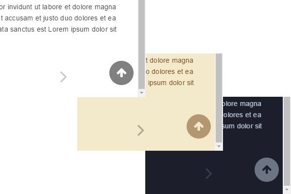

# Gitbook Back to Top Button Plugin

This plugin adds a back to top button to your GitBook. All three GitBook themes (White, Sepia, Night) are supported.

## Usage

Add the plugin to your `book.json`:

```
{
	"plugins" : [ "back-to-top-button" ]
}		
```

## Screenshots

The back to top button in action:



## Changelog

* 0.1.0 Releases:
  * 0.1.0 First working release
  * 0.1.1 Minimal Gitbook version changed to 3.1.1
  * 0.1.2 Added link to GitHub repository 
  * 0.1.3 Added support for GitBook themes (White, Sepia, Night)
